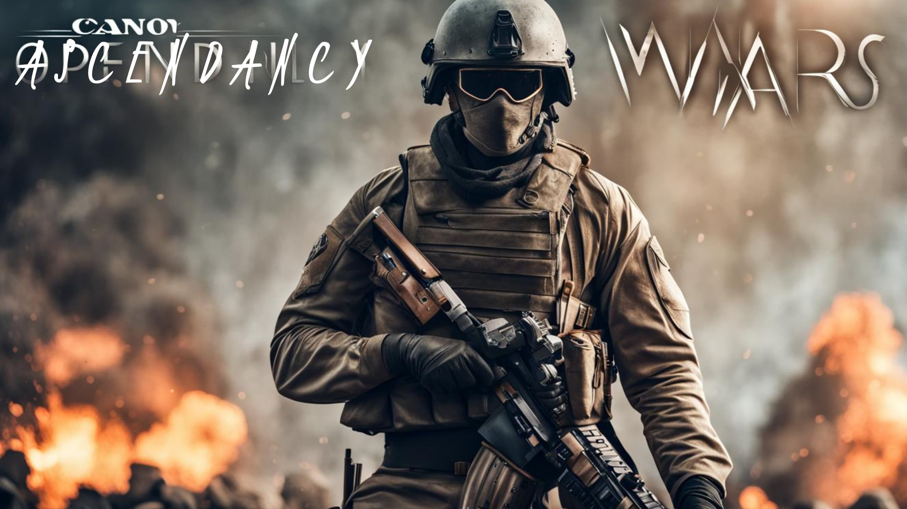

# Ascendancy Wars SP (Altis) 

## Story

> _"If you work in a profession where people die young, make sure you don't die young"_

_"In the war-torn land of Altis, the citizens have long suffered under the oppressive rule of CSAT, a government that has failed to meet even their most basic needs. As the proud nation of Livonia, renowned for its strength and resilience, you have decided to take matters into your own hands.  
Realizing that a direct assault against the might of CSAT's army would be futile, a daring plan emerges. You will infiltrate Altis, not as an enemy, but as one of its own citizens. Disguised and hidden amidst the turmoil, you will seize the opportunity to ignite a revolution from within.  
The stakes are high, and the odds seem insurmountable. But armed with your wits, determination, and the support of fellow Livonian operatives, you embark on a treacherous journey. Every step taken brings you closer to the heart of Altis, where the fate of an entire nation hangs in the balance.  
As you navigate the bustling streets and shadowy alleys, you must not only evade the watchful eyes of CSAT but also win the trust and loyalty of Altis' weary citizens. Show them a glimmer of hope, offer them a chance at a brighter future, and they may rise up alongside you, ready to make the ultimate sacrifice for their freedom.  
The path to victory will be fraught with danger, requiring strategic thinking, precise execution, and a deep understanding of the human spirit. Your actions will shape the destiny of Altis and leave an indelible mark on its history.  
Will you be the hero that Altis needs? Will you lead a nation towards liberation, defying the odds and inspiring others to join your cause? The stage is set, the mission awaits. Experience the intensity, the drama, and the thrill of this cinematic journey in Arma 3. Step into the shoes of a true warrior and become the catalyst for change in Altis._"

## Getting Started
* Welcome to an exciting and immersive Arma 3 mission! Prepare yourself for a dynamic and challenging experience that will test your tactical skills and decision-making abilities.

* In this mission, you will engage in intense combat scenarios and strategic challenges. The objective is to capture and control key zones, utilizing your team's abilities to gain an advantage over the enemy forces.

* Stay on high alert as the enemy will send reinforcements and may launch attacks on your controlled zones. Defend your territory and repel their assaults to maintain control and secure your position.

* Experience the realism of the battlefield with features such as a revive system, allowing you to bring fallen comrades back into action. Work together with your team to provide medical assistance and ensure that no soldier is left behind.

* Incapacitated bleedout adds a sense of urgency to your actions. Timely medical intervention is crucial to prevent casualties and keep your team at full strength.

* Navigate the mission with the option to utilize a civilian disguise system. Assume civilian or enemy identities to infiltrate restricted areas, gather intelligence, and complete covert operations. Be cautious and avoid raising suspicions to maintain your cover and complete your objectives successfully.

* Throughout the mission, you will have access to a variety of vehicles strategically placed in towns and bases. Utilize these vehicles to enhance your mobility and firepower on the battlefield.

* Expand your capabilities by purchasing vehicles, allowing you to customize your loadout and optimize your effectiveness in combat. Additionally, visit the HQ to buy weapons and gear from a dedicated weapon dealer, ensuring you are equipped with the best tools for the mission.

* Engage in side missions that offer additional challenges and rewards. These missions will test your versatility and provide opportunities for resource acquisition and strategic advantages.

* Stay supplied and ready for action with air supply drops. Utilize these drops strategically to replenish your resources and gain a tactical advantage over the enemy.

* Customize your loadout and adapt to different mission requirements with an arsenal at your disposal. Equip yourself with the best weapons, gear, and equipment to optimize your effectiveness in combat.

* Manage your vehicles efficiently with the vehicle garage. Repair, refuel, and customize your vehicles to ensure they are in optimal condition for your missions.

* Prepare yourself for an immersive and challenging mission that combines intense combat, strategic decision-making, and a range of features designed to enhance your gameplay experience. Are you ready to lead your team to victory and accomplish your mission objectives?

### Why Ascendancy Wars?

Ascendancy Wars was created hugely inspired by popular mods like Antistasi, Overthow and Vindicta.
I first create this project because I feel some of the mentioned mods lacks some features, like something in Antistasi doesn't exist in Vindicta or vice versa.
I know they make their mision/mod different from others is to make them unique from others. But sometimes, the lack of some features make the mission feels incomplete.
So I make Ascendancy Wars combining their features, but different too at the same time.

What is the difference?
* For others, it is guerrila simulator. But for Ascendancy Wars, it is war simulation.
  Be a spy, launch attacks from inside based on intels, recruit citizens from Altis, or you can recruit soldiers from your army to fight by your side.
  But in the end, its all about revolution.
* more.. I will add in the future

### Features

* Choose whether to recruit local population, or recruit army from your HQ

* Conflict Dynamics and Adversarial Response System  
  CDARS is an innovative system that revolutionizes the way player actions impact the enemy's perception and behavior.  
  This dynamic system tracks and manages player bounties, reflecting the level of animosity the enemy holds towards  
  the player based on a wide range of actions such as attacking outposts, military bases, and airports, capturing prisoners,  
  eliminating high-ranking officers, and even accounting for inaction. The system goes beyond mere numerical values,  
  offering a comprehensive view of the enemy's reaction and actions over time. With CDARS, players can experience a truly  
  immersive and responsive battlefield, where their choices and achievements shape the enemy's behavior and ultimately  
  determine the outcome of the mission

### Dependencies

* CBA
* Real Engine (Optional)
* But note that this mission is Single-Player only. Multiplayer needs to be reconsidered if ones requested. But for now, it is all about you yourself.

## Help and FAQ

For now there is no issue (not that I know of). If there is one, just let me know

## License

 

With this licence you are free to adapt (i.e. modify, rework or update) and share (i.e. copy, distribute or transmit) the material under the following conditions:

* Attribution - You must attribute the material in the manner specified by the author or licensor (but not in any way that suggests that they endorse you or your use of the material).
* Noncommercial - You may not use this material for any commercial purposes.
* Arma Only - You may not convert or adapt this material to be used in other games than Arma.
* Share Alike - If you adapt, or build upon this material, you may distribute the resulting material only under the same license.

## Acknowledgments

Inspiration, code snippets, etc.
* [A3 Antistasi](https://github.com/official-antistasi-community)
* [Vindicta](https://github.com/Sparker95/Vindicta)
* [Overthrow](https://github.com/ArmaOverthrow/Overthrow)

## Authors And Contributors
Nikolai (Prince F90)

### Script and Mod Contributors

* [Persistent Save System by Sukhoi191](https://gitlab.com/sukhoi191_a3/arma-3-persistent-save-system)
* [L_ambiCivs by LAxemann](https://github.com/LAxemann/L_ambiCivs)
* [UPS by Kronzky](https://www.kronzky.info/ups)
* [INC_undercover by Incontinentia](https://github.com/1ncontinentia/Incon-Undercover)
